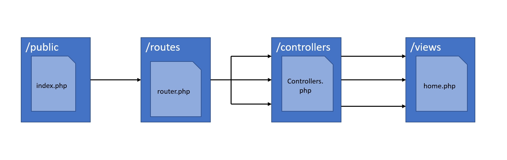

# Projeto Simples de Rotas em PHP

Sistema de rotas simples, usando conceito de orientação a objetos em php



## Instruções do projeto

Faça o clone do projeto:

```
git clone https://github.com/eliaquinn/routes-php.git
```

Execute o seguinte comando, para atualizar e baixar as libs necessárias

```
composer update
```

Após a atualização rode o seguinte comando.

```
php -S localhost:8000 -t public
```